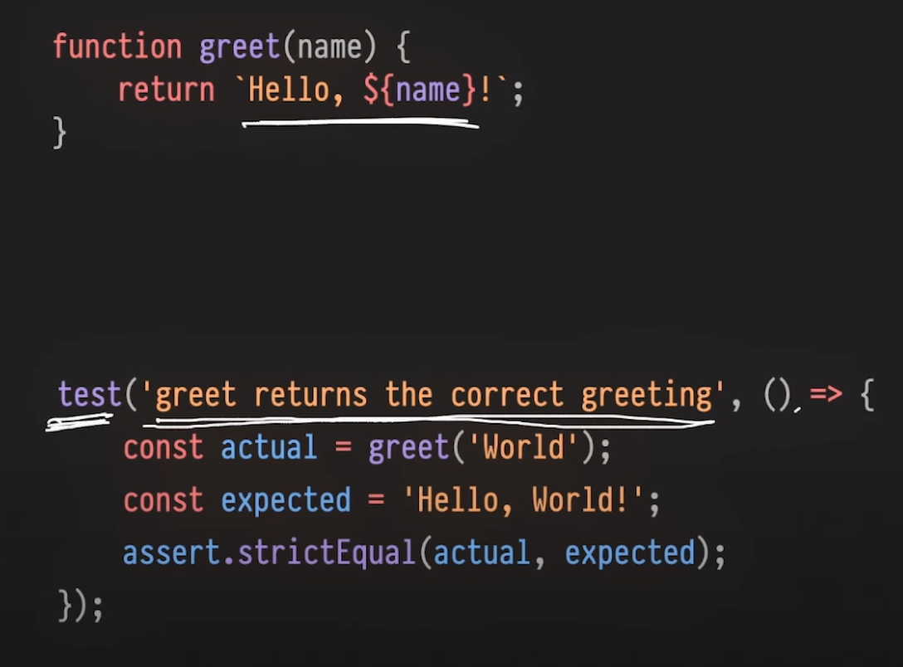
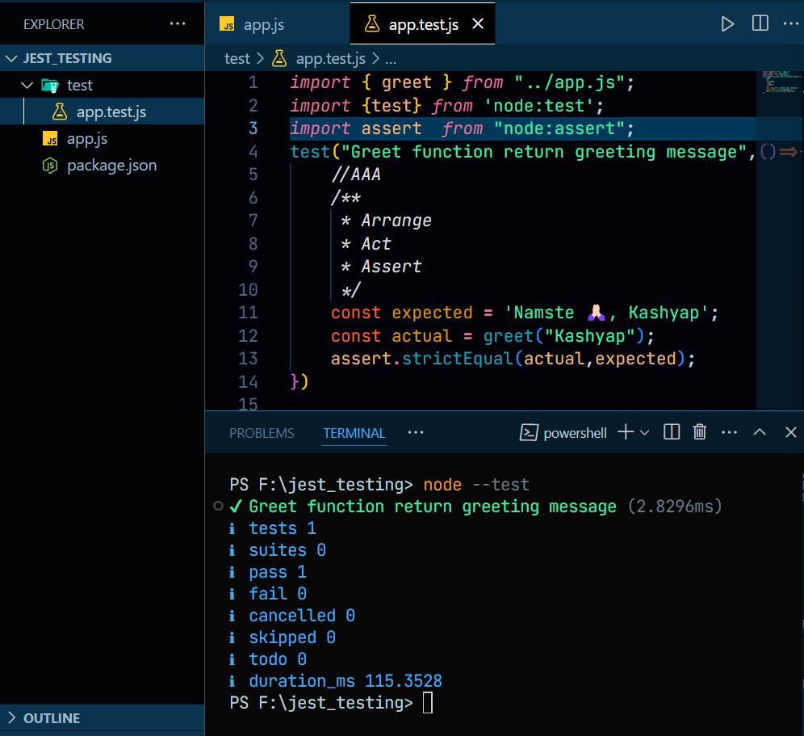
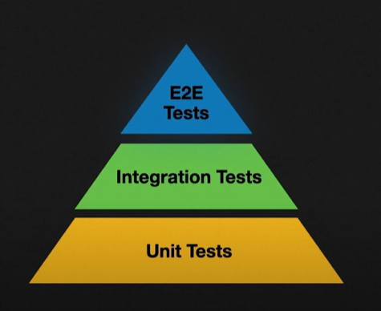

# 📚 Node.js Testing Guide

**This project uses Node.js's built-in node:test module for writing and running unit tests, eliminating the need for external libraries like Jest. The test files are organized under the /test directory and executed using the node --test command.**


## 🧪 Unit Testing
- Tests small pieces of code
- Runs in isolation (individual tests don't depend on each other)



---

## 🔍 The AAA Pattern in Unit Testing

```
1️⃣ Arrange - Set up test data and conditions
2️⃣ Act - Execute the code being tested
3️⃣ Assert - Verify the results are as expected
```



---

## 📦 Test Organization

1. Suits are for grouping related tests
2. `describe` is an alias for Suits

---

## 🎭 Mocking

Simulates behavior of dependencies during testing. For example, if function A calls function B internally, we can mock function B.

For more detailed examples, check out `order.test.js`

---

## 🧱 Stubs

Stubs provide ready-made data, similar to mocks, but without tracking call count and other behaviors that mocks provide.

---

## 📸 Snapshot Testing — Mostly Used in Frontend

Especially useful for frontend testing when API responses return large JSON objects. Instead of manually asserting each key-pair, snapshots automatically compare the entire structure.

To update snapshots, run:

```
node --test --test-update-snapshots
```

---

## 🔄 Integration Testing

Tests how different parts of the application work together.

Every API endpoint is tested using libraries like Jest.

Supertest is excellent for this type of testing.

---

## 🌐 End-to-End Testing

Tests the entire application flow as a user would experience it:
- Open browser
- Fill in forms
- Check all interactions

Tools: Cypress, Playwright, Puppeteer

---

## 📊 Testing Distribution (Industry Standard)

- E2E Testing: 10%
- Integration Testing: 20%
- Unit Testing: 70%



⚡ Performance Tip: Make sure tests run as fast as possible. Slow tests increase release time and can increase costs when running in CI/CD pipelines on services like EC2.

---

## 🧠 TDD — Test-Driven Development

Reverses the typical development process:
1. Write tests for edge cases first
2. Implement the functionality to pass those tests


---

# Software Testing Types

## 1. Functional Testing
- **Unit Testing**
- **Integration Testing**
- **System Testing**
- **User Acceptance Testing (UAT)**
- **Smoke Testing**
- **Sanity Testing**
- **Regression Testing**
- **Interface Testing**

## 2. Non-Functional Testing
- **Performance Testing**
  - Load Testing
  - Stress Testing
  - Spike Testing
  - Endurance Testing
- **Security Testing**
- **Usability Testing**
- **Compatibility Testing**
- **Reliability Testing**
- **Scalability Testing**
- **Accessibility Testing**

## 3. Maintenance Testing
- **Regression Testing**
- **Maintenance Testing**

## 4. Other Testing Types
- **Alpha Testing**
- **Beta Testing**
- **Ad-hoc Testing**
- **Exploratory Testing**
- **Black Box Testing**
- **White Box Testing**
- **Grey Box Testing**
- **Static Testing**
- **Dynamic Testing**


---
